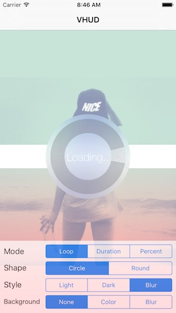
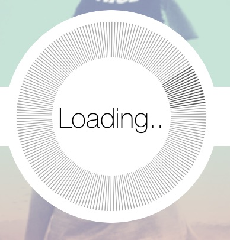
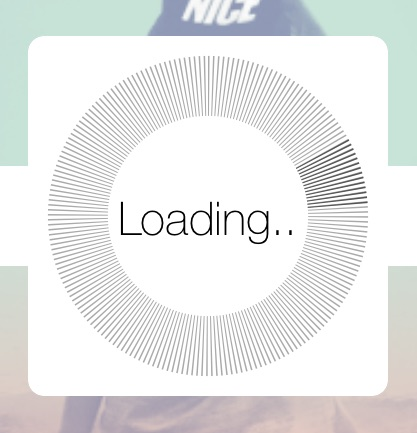
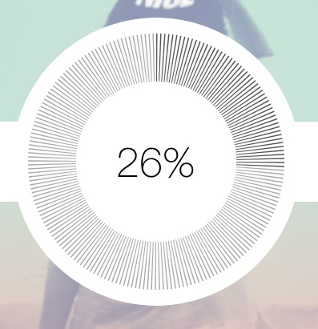
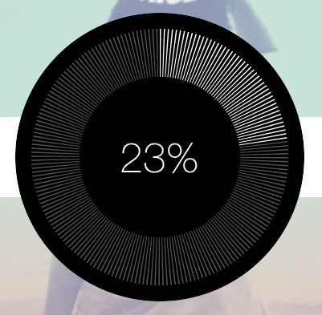
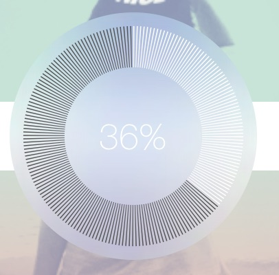
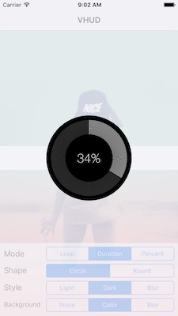
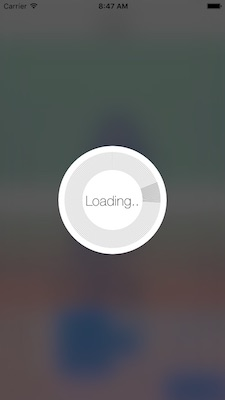

# VHUD

[](http://cocoadocs.org/docsets/VHUD)
[](https://developer.apple.com/swift/)
[](https://developer.apple.com/swift/)
[](https://developer.apple.com/swift/)

Simple HUD.



VHUD is inspired by [PKHUD](https://github.com/pkluz/PKHUD).

## Example

### Show

```swift

import VHUD

func example() {
  var content = VHUDContent(.loop(3.0))
  content.loadingText = "Loading.."
  content.completionText = "Finish!"

  VHUD.show(content)
}

```

### Dismiss

```swift

// duration, deley(Option), text(Option), completion(Option)
VHUD.dismiss(1.0, 1.0)

```

## Mode

- Loop
- Duration
- PercentComplete

## Customization

### Shape

- circle

```swift

var content = VHUDContent(.loop(3.0))
content.shape = .circle
VHUD.show(content)

```



- round

```swift

var content = VHUDContent(.loop(3.0))
content.shape = .round
VHUD.show(content)

```



And Custom (using closure)

### Style

- light

```swift

var content = VHUDContent(.loop(3.0))
content.shape = .circle
content.style = .light
VHUD.show(content)

```



- dark

```swift

var content = VHUDContent(.loop(3.0))
content.shape = .circle
content.style = .dark
VHUD.show(content)

```



- blur

```swift

var content = VHUDContent(.loop(3.0))
content.shape = .circle
content.style = .blur(.light)
VHUD.show(content)

```



### Background

- none

```swift

var content = VHUDContent(.loop(3.0))
content.shape = .circle
content.style = .blur(.light)
content.background = .none
VHUD.show(content)

```


- color

```swift

var content = VHUDContent(.loop(3.0))
content.shape = .circle
content.style = .dark
content.background = .color(#colorLiteral(red: 0.937254902, green: 0.937254902, blue: 0.9568627451, alpha: 0.7))
VHUD.show(content)

```



- blur

```swift

var content = VHUDContent(.loop(3.0))
content.shape = .circle
content.style = .light
content.background = .blur(.dark)
VHUD.show(content)

```



## Requirements

* Xcode 9.3+

|            | OS                         | Swift         |
|------------|------------------|--------------|
| **v1.1.x** | iOS 8+ | 3.0      |
| **v1.2.x** | iOS 8+ | 3.2      |
| **v1.3.x** | iOS 9+ | 4.1      |

## Installation

#### CocoaPods

You can use [CocoaPods](http://cocoapods.org/) to install `VHUD` by adding it to your `Podfile`:

```ruby

use_frameworks!
pod 'VHUD'

```

To get the full benefits import `VHUD` wherever you import UIKit

``` swift

import UIKit
import VHUD

```

#### Carthage

You can use [Carthage](https://github.com/Carthage/Carthage) to install `VHUD` by adding it to your `Cartfile`:

```

github "xxxAIRINxxx/VHUD"

```

To get the full benefits import `VHUD` wherever you import UIKit

``` swift

import UIKit
import VHUD

```
#### Manually

1. Download and drop ```/Sources``` folder in your project.  
2. Congratulations!  

## License

MIT license. See the LICENSE file for more info.
